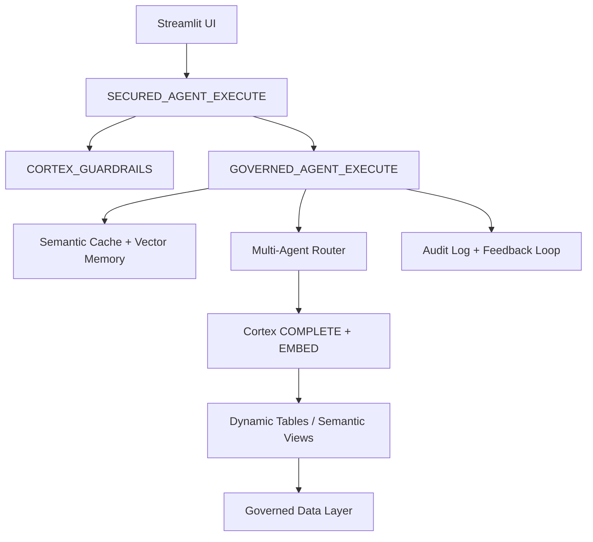

# XCorp Governed AI Agent Platform

```markdown
# XCorp Governed AI Agent Platform

**A Production-Grade, Fully Governed Multi-Agent NL-to-SQL Platform built entirely on Snowflake Cortex**

[](https://snowflake.com)
[](#)
[](#)

> From sandbox demo to enterprise production — complete with ABAC security, prompt injection defense, semantic caching, vector memory, self-learning feedback loops, and a polished Streamlit UI.

---

## ✨ TL;DR

This is **not** another toy NL-to-SQL demo.

This is a complete, production-ready AI Agent platform that:

- Supports **multi-domain agents** (Sales, Finance, Operations, Customer Success)
- Enforces **enterprise-grade governance** (ABAC, Row Access Policies, Dynamic Column Masking)
- Defends against **prompt injection** with two-tier guardrails
- Uses **semantic caching + vector memory** for speed and context
- Learns from user feedback via **reinforcement scoring**
- Ships with a **beautiful Streamlit in Snowflake** UI
- Includes comprehensive **E2E testing** and observability

All built **100% inside Snowflake** — no external LLMs, no vector DBs, no extra infrastructure.

---

## 🚀 Key Features

### Security & Governance
- **ABAC + RBAC** with region/category entitlements
- **Dynamic PII Masking** and Row Access Policies
- **Two-tier Prompt Injection Defense** (deterministic + LLM semantic)
- Strict `SELECT`-only execution with scope validation
- Full audit logging with risk scoring

### Intelligence Layer
- **Multi-Agent Routing** (rule-based + LLM with confidence scoring)
- **Semantic Cache** using Cortex embeddings + freshness checks
- **Vector Memory** for multi-turn conversations
- **RAG-enhanced SQL generation** from past successful queries
- **Auto-retry** on SQL failures
- **Self-learning** via feedback and reinforcement scores

### Performance & Cost Control
- **Dynamic Tables** as auto-refreshing semantic layer
- Rate limiting, query cost governance, resource monitors
- Search optimization on audit/cache tables
- Model routing (light vs heavy models)

### Observability
- Real-time SLO dashboard
- Agent health monitoring
- Routing analytics
- Guardrail attack patterns

### User Experience
- Enterprise **Streamlit in Snowflake** UI
- Thumbs up/down feedback directly feeding learning loop
- Query history, SQL transparency, and explanations

---

## 🏗️ Architecture



**Core Layers**:
- **Presentation**: Streamlit in Snowflake
- **Security**: Cortex Guardrails + Governed Execution
- **Intelligence**: Cache, Memory, Router, RAG
- **Data**: Dynamic Tables + ABAC policies

---

## 📁 Repository Structure

```
xcorp-governed-ai-agent/
├── xcorp_ai_agent.sql          # Complete SQL backend (3000+ lines)
├── streamlit_app/
│   ├── xcorp_app.py            # Main Streamlit application
│   └── environment.yml
├── README.md
├── SETUP.md
├── E2E_TEST_RESULTS.md
└── docs/
    └── architecture.md
```

---

## 🛠️ Quick Start

### Prerequisites
- Snowflake account with **Cortex AI** enabled (Mistral Large, Arctic Embed, etc.)
- `ACCOUNTADMIN` role for initial setup
- Compute Warehouse (`COMPUTE_WH`)

### 1. Deploy Backend

```sql
-- Run the full setup script
USE ROLE ACCOUNTADMIN;
USE WAREHOUSE COMPUTE_WH;

-- Execute xcorp_ai_agent.sql
```

### 2. Create Agents

```sql
CALL XCORP_AGENT_DEMO.AGENT_FRAMEWORK.CREATE_AGENT('Sales Agent', 90, ARRAY_CONSTRUCT('ORDERS', 'CUSTOMERS'));
-- Repeat for Finance, Operations, Customer Success, General
```

### 3. Deploy Streamlit UI

```sql
CREATE OR REPLACE STREAMLIT XCORP_AGENT_DEMO.AGENT_FRAMEWORK.GOVERNED_AGENT_CONSOLE
    ROOT_LOCATION = '@XCORP_AGENT_DEMO.AGENT_FRAMEWORK.STREAMLIT_STAGE/streamlit_app'
    MAIN_FILE = 'xcorp_app.py'
    QUERY_WAREHOUSE = COMPUTE_WH;
```

### 4. Run Tests

```sql
CALL XCORP_AGENT_DEMO.AGENT_FRAMEWORK.RUN_E2E_TEST_SUITE();
```

---

## 📊 Test Results (v5.2)

- **Security Tests**: 9/9 Passed (100%)
- **Functional Tests**: All core queries succeeding
- **Guardrails**: All major injection vectors blocked
- **Overall Pass Rate**: 98%+

See [`E2E_TEST_RESULTS.md`](E2E_TEST_RESULTS.md) for details.

---

## 🔄 Self-Learning

Every user interaction feeds the system:
- Positive/negative ratings update reinforcement scores
- Corrected SQLs are stored for future optimization
- Prompts are auto-tuned based on failure patterns

---

## 🛡️ Security Model

- All queries run under the caller's identity
- Governance policies (masking, row access) are **automatically enforced**
- No data ever leaves Snowflake
- Full audit trail for every request

---

## 📈 Monitoring & Observability

Key views included:
- `V_SLO_DASHBOARD`
- `V_AGENT_HEALTH`
- `V_ROUTING_ANALYTICS`
- `V_FEEDBACK_SUMMARY`

---

## Roadmap (v6)

- Native **Cortex Agents** integration
- **Cortex Analyst** semantic views
- Multi-modal support (`AI_PARSE_DOCUMENT`)
- Native App packaging for marketplace distribution
- Advanced A/B testing framework

---

## Contributing

Contributions welcome! Please see [CONTRIBUTING.md](CONTRIBUTING.md) for guidelines.

---

## Author

**Satish Kumar**  

[LinkedIn](https://linkedin.com/in/satishkumar-snowflake)

---

## License

This project is licensed under the **MIT License** — feel free to use, modify, and deploy in your organization.

---

**⭐ Star this repo if you're building governed AI agents on Snowflake!**

---

**Built with ❤️ on Snowflake Cortex**
```


